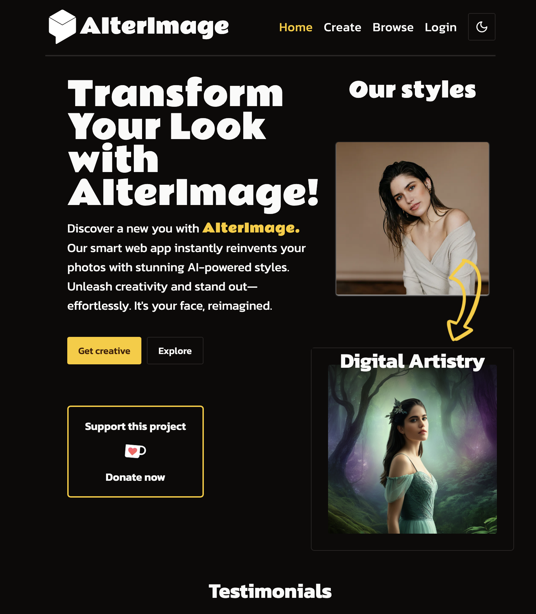

# [AIterImage  🔗](https://alter-image.vercel.app/)

## About the Project  
AIterImage is an innovative web application that harnesses the power of artificial intelligence to transform users' portrait photos into stunning pieces of art. By integrating with the Replicate AI API, AIterImage offers users the ability to reimagine their portraits with a variety of styles and backgrounds, providing a unique and personalized experience. 

### How It Works  
-  **Upload a Portrait**: Users start by uploading a portrait photo of themselves. 
-  **Temporary Storage**: The uploaded photo is temporarily stored on imgBB for one hour, ensuring user privacy. 
-  **Style Selection**: Users can choose from 10 different styles to apply to their photo. 
-  **AI Transformation**: Upon form submission, a call is made to the Replicate AI API to generate the stylized photo. 
-  **Delivery and Storage**: The transformed image is returned to the user, while also being saved to Cloudinary for persistent storage. 
-  **Database Logging**: Information about the chosen style, description, and persistent Cloudinary links are stored in MongoDB. 
-  **Browse Creations**: Users can explore all the artistically reimagined photos in a responsive grid layout optimized for both PC and mobile. ### Technologies Used  
-  **TailwindCSS**: For crafting a responsive and stunning grid layout. 
-  **Clerk**: To provide user authentication and ensure that only authenticated users can access the AI transformation feature. 
-  **ShadCN UI Library**: Utilized for consistent and clean UI components throughout the application. 
-  **Next.js**: As the foundation of the web app, providing server-side rendering and static generation capabilities, hosted on Vercel. 
-   **Zod**: Employed for robust form validation to ensure data integrity. 
-   **Embla Carousel**: For creating smooth, accessible carousels that enhance the user interface. 
-  **Mongoose**: To interact with MongoDB, enabling efficient data storage and retrieval. 
### Security and Performance
  Security is a top priority for AIterImage, achieved through the use of Clerk for authentication and privacy-conscious storage practices. The application boasts an intuitive user interface, thanks to the ShadCN UI Library, and is optimized for performance by leveraging the scalability and reliability of Vercel's hosting platform. 
  
  ---  Enjoy transforming your images into AI-powered masterpieces with AIterImage! For more information, issues, or feature requests, please check out the [issues page](https://github.com/Danieldo1/edit-it/issues). 
  
## Getting Started
 To use AIterImage, simply visit [website link] and sign in. Once authenticated, the world of AI-powered image transformation is at your fingertips. 
## Contributing  
 Contributions are what make the open-source community such an amazing place to learn, inspire, and create. Any contributions you make are **greatly appreciated**. 
 1. Fork the Project 
 2. Create your Feature Branch (`git checkout -b feature/AmazingFeature`) 
 3. Commit your Changes 
 4. (`git commit -m 'Add some AmazingFeature'`) 
 5. Push to the Branch 
 6. (`git push origin feature/AmazingFeature`) 
 7. Open a Pull Request 
 
## License  
 Distributed under the [LICENSE](). See `LICENSE` for more information. 
 
 ## Contact  Daniil Speranskii 
 Email me: [click here](mailto:daniel.speranskiy@gmail.com)